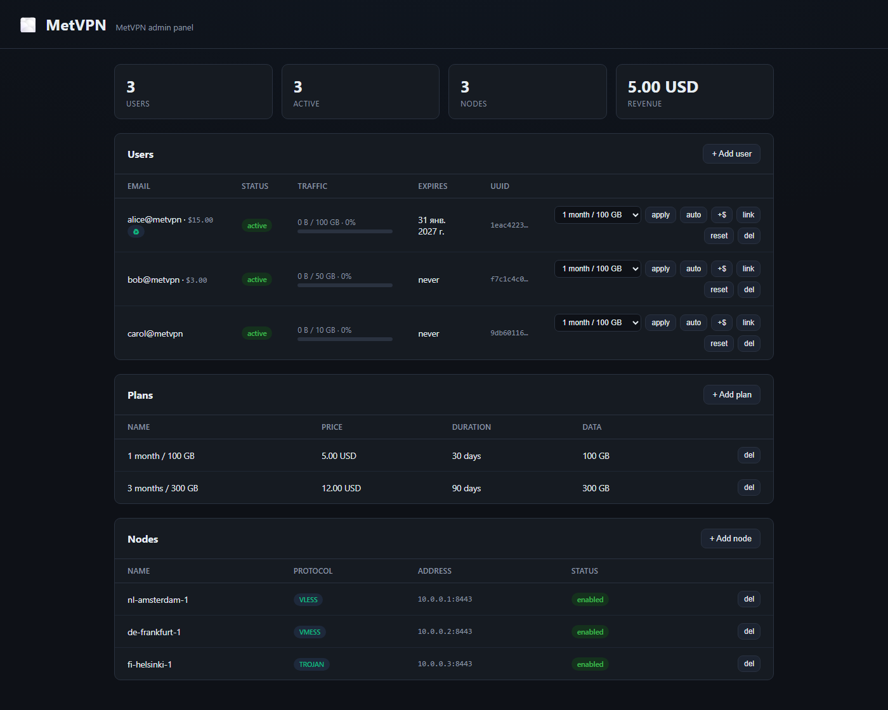

<div align="center">

# 🌫️ Wisp

**A simple, single-binary, multi-node VPN panel — with billing built in.**

Manage Xray-based VPN users across many servers from one clean dashboard.
No Python virtualenvs, no `node_modules` on your server — just one binary.

[](https://github.com/w99betaCODER/Wisp/actions/workflows/ci.yml)
[](https://go.dev)
[](LICENSE)

</div>



---

## Why Wisp?

[Marzban](https://github.com/Gozargah/Marzban) and [3x-ui](https://github.com/MHSanaei/3x-ui) are great, but they leave gaps:

| | 3x-ui | Marzban | **Wisp** |
|---|:---:|:---:|:---:|
| Multi-node | ❌ | ✅ | ✅ |
| Single binary deploy | ❌ | ❌ | ✅ |
| Traffic quota & expiry | ✅ | ✅ | ✅ |
| Clean, modern UI | ⚠️ | ⚠️ | ✅ |
| Built-in billing | ❌ | ❌ | ✅ |
| White-label / resellers | ❌ | ❌ | ✅ *(planned)* |

Wisp's two principles are **simplicity** and **functionality**: trivial to install,
powerful enough to run a real VPN business.

## Status

> ⚠️ **Early development.** Working today: SQLite persistence, Xray gRPC
> integration (VLESS + Reality), base64 subscription links, **multi-node** (a
> panel driving any number of node agents over mTLS), **traffic accounting**
> with automatic disable on quota or expiry, **billing** (plans, orders,
> apply-on-payment), and an **embedded web dashboard**.

## Quick start

Requires [Go 1.26+](https://go.dev/dl/).

```bash
git clone https://github.com/w99betaCODER/Wisp.git
cd Wisp
go run ./cmd/panel
# panel is now on http://localhost:8080
```

Try the API:

```bash
# health check
curl http://localhost:8080/healthz

# create a user (data_limit in bytes and expires_at are optional)
curl -X POST http://localhost:8080/api/users \
  -H 'Content-Type: application/json' \
  -d '{"email":"alice@vpn","data_limit":107374182400,"expires_at":"2026-12-31T23:59:59Z"}'

# list users
curl http://localhost:8080/api/users
```

## API

| Method | Path | Description |
|---|---|---|
| `GET` | `/healthz` | Liveness probe |
| `GET` | `/api/users` | List all users |
| `POST` | `/api/users` | Create a user (`{"email", "data_limit"?, "expires_at"?}`) |
| `GET` | `/api/users/{id}` | Get one user |
| `DELETE` | `/api/users/{id}` | Delete a user |
| `POST` | `/api/users/{id}/reset` | Reset traffic to 0 and re-enable the user |
| `GET` | `/api/nodes` | List registered nodes |
| `POST` | `/api/nodes` | Register a node (`{"name": "...", "address": "host:port"}`) |
| `GET` | `/api/nodes/{id}` | Get one node |
| `DELETE` | `/api/nodes/{id}` | Remove a node |
| `GET` | `/api/plans` | List plans |
| `POST` | `/api/plans` | Create a plan (`{"name","price_cents","currency","duration_days","data_limit"}`) |
| `DELETE` | `/api/plans/{id}` | Delete a plan |
| `GET` | `/api/orders` | List orders |
| `POST` | `/api/orders` | Open an order (`{"user_id","plan_id"}`) |
| `POST` | `/api/orders/{id}/pay` | Settle an order and apply its plan to the user |
| `GET` | `/sub/{id}` | Subscription content (base64 share links) for a VPN client |

## Configuration

All settings come from environment variables (sensible defaults shown):

| Variable | Default | Description |
|---|---|---|
| `WISP_ADDR` | `:8080` | HTTP listen address |
| `WISP_DB` | `wisp.db` | SQLite database file (`:memory:` for ephemeral) |
| `WISP_XRAY_API` | _(empty)_ | Xray gRPC API `host:port`. Empty → no-op client (users stored but not pushed to Xray) |
| `WISP_INBOUND_TAG` | `vless-reality` | Tag of the Xray inbound users are added to |
| `WISP_NODE_HOST` | `127.0.0.1` | Public host/IP clients dial |
| `WISP_NODE_PORT` | `443` | Public port |
| `WISP_NODE_FLOW` | `xtls-rprx-vision` | VLESS flow |
| `WISP_REALITY_PBK` | _(empty)_ | Reality public key |
| `WISP_REALITY_SNI` | `www.microsoft.com` | Reality SNI |
| `WISP_REALITY_SID` | _(empty)_ | Reality short id |
| `WISP_REALITY_FP` | `chrome` | uTLS fingerprint |
| `WISP_NODE_TLS_CERT` | _(empty)_ | Panel mTLS client cert. Empty → talk to nodes over plain HTTP (dev only) |
| `WISP_NODE_TLS_KEY` | _(empty)_ | Panel mTLS client key |
| `WISP_NODE_TLS_CA` | _(empty)_ | CA that verifies node server certs |
| `WISP_ENFORCE_INTERVAL` | `60` | Seconds between traffic-accounting + quota/expiry sweeps |

The **node agent** (`cmd/node`) reads its own variables:

| Variable | Default | Description |
|---|---|---|
| `WISP_AGENT_LISTEN` | `:8443` | Agent listen address |
| `WISP_XRAY_API` | _(empty)_ | Local Xray gRPC API `host:port` |
| `WISP_INBOUND_TAG` | `vless-reality` | Xray inbound tag |
| `WISP_TLS_CERT` | _(empty)_ | Agent server cert. Empty → plain HTTP (dev only) |
| `WISP_TLS_KEY` | _(empty)_ | Agent server key |
| `WISP_TLS_CLIENT_CA` | _(empty)_ | CA that verifies the panel's client cert |

With `WISP_XRAY_API` unset, both panel and agent run fully without Xray — every
user operation is logged instead of sent to a proxy, which is how you develop
locally.

## Multi-node setup

The panel controls each VPN server through a small **node agent** over mutual
TLS. To wire one up:

```bash
# 1. Generate the CA + server + client certs (run once, on the panel host)
go run ./cmd/wisp-certs -dir certs -host node1.example.com

# 2. On the VPN server: run the agent with its server cert + the CA
WISP_TLS_CERT=server.crt WISP_TLS_KEY=server.key WISP_TLS_CLIENT_CA=ca.crt \
WISP_XRAY_API=127.0.0.1:10085 \
  ./node          # listens on :8443 (mTLS)

# 3. On the panel: run with the client cert + the CA
WISP_NODE_TLS_CERT=client.crt WISP_NODE_TLS_KEY=client.key WISP_NODE_TLS_CA=ca.crt \
  ./panel

# 4. Register the node, then every user is pushed to it automatically
curl -X POST http://localhost:8080/api/nodes \
  -H 'Content-Type: application/json' \
  -d '{"name":"node1","address":"node1.example.com:8443"}'
```

User add/remove fans out to every enabled node, best-effort: a node that is
down is logged and skipped, never blocking the operation.

## Billing

Define **plans** (price, duration, data quota); a user buys one by opening an
**order**, and settling the order applies the plan — extending the user's
expiry (stacking onto any remaining time), resetting the quota and usage, and
re-enabling access.

```bash
# create a plan: $5, 30 days, 100 GB
curl -X POST http://localhost:8080/api/plans -H 'Content-Type: application/json' \
  -d '{"name":"1 month / 100 GB","price_cents":500,"currency":"USD","duration_days":30,"data_limit":107374182400}'

# open an order for a user + plan, then settle it
curl -X POST http://localhost:8080/api/orders -H 'Content-Type: application/json' \
  -d '{"user_id":"<uid>","plan_id":"<pid>"}'
curl -X POST http://localhost:8080/api/orders/<order-id>/pay
```

The `pay` endpoint is the manual/admin path. A real payment gateway plugs in by
verifying its webhook signature and then calling the same `billing.Apply` logic
— so adding Cryptomus, YooKassa, Telegram Payments, Stripe, etc. is a small,
self-contained change.

## Architecture

Wisp is a **control plane / data plane** system:

```
┌─────────────────────────────────┐
│   PANEL  (control plane)         │   Go API + SQLite + Web UI
│   users · billing · limits       │
└───────────────┬─────────────────┘
                │ HTTPS + mTLS
      ┌─────────┼─────────┐
      ▼         ▼         ▼
  ┌───────┐ ┌───────┐ ┌───────┐
  │ NODE  │ │ NODE  │ │ NODE  │       Go agent, drives local Xray
  │ agent │ │ agent │ │ agent │       over gRPC on each VPN server
  └───────┘ └───────┘ └───────┘
```

The panel never forwards VPN traffic itself — it tells each node's agent which
clients to accept, and the agent applies them to the local Xray over gRPC.
See [`internal/`](internal/) for the package layout and [`cmd/`](cmd/) for the
`panel`, `node` and `wisp-certs` binaries.

## Roadmap

- [x] **Phase 0** — Control-plane skeleton: HTTP API, user CRUD, in-memory store
- [x] **Phase 1** — SQLite persistence + Xray gRPC integration (VLESS + Reality), subscription links
- [x] **Phase 2** — Multi-node: node agent, mTLS, user distribution
- [x] **Phase 3** — Traffic accounting, quota & expiry, auto-disable
- [x] **Web dashboard** — embedded single-page admin UI (zero build step)
- [x] **Phase 4** — Billing: plans, orders, apply-on-payment (webhook-ready)
- [ ] **Phase 5** — White-label / resellers, recurring auto-renewal, real gateways

## Development

```bash
make run      # start the panel
make test     # run tests
make build    # build all binaries into ./bin
make vet      # static checks
```

Binaries (`cmd/`):

- **`panel`** — the control-plane API + (future) web UI
- **`node`** — the node agent that runs next to Xray on each VPN server
- **`wisp-certs`** — one-shot generator for the panel↔node mTLS certificates

## License

[MIT](LICENSE)
